# 📦 n8n-nodes-signal-cli

<p align="center">
  
</p>

This repository contains n8n nodes for interacting with Signal CLI. It includes a trigger node for receiving messages and an action node for various Signal operations.

## 📚 Table of Contents
1. [📋 Prerequisites](#-prerequisites)
2. [🚀 Usage](#-usage)
3. [📥 Installation](#-installation)
4. [🤖 Nodes](#-nodes)
5. [💻 Development](#-development)
6. [🚀 Release](#-release)
7. [🤝 Contributing](#-contributing)
8. [⚠️ Known Limitations](#-known-limitations)
9. [📄 License](#-license)

## 📋 Prerequisites

* Node.js (>=18.10) and pnpm (>=9.1)
* n8n installed globally using `pnpm install n8n -g`
* [Signal CLI](https://github.com/AsamK/signal-cli) set up and running in daemon mode with HTTP JSON-RPC endpoint exposed (`--http`)
<details>
<summary>🐳 Docker command to run signal-cli locally</summary>

```bash
docker run -d \
    --name signal-cli \
    --restart=always \
    -p 7583:7583 \
    -p 8085:8085 \
    -v "$(pwd)/signal-cli:/var/lib/signal-cli" \
    --tmpfs /tmp:exec \
    --shm-size=64m \
    registry.gitlab.com/packaging/signal-cli/signal-cli-native:latest \
    daemon --http=0.0.0.0:8085
```

</details>

## 📥 Installation

1. Clone this repository.
2. Run `pnpm install` to install dependencies.
3. Run `pnpm build` to build the nodes.
4. Run `npm i n8n-nodes-signal-cli` in `~/.n8n/custom/nodes`
   
## 🤖 Nodes

### 🔔 SignalTrigger

* Triggers when a new message is received via Signal CLI.
* Requires [Signal CLI](https://github.com/AsamK/signal-cli) API credential.
* Parameters:
  * `account`: Signal account to listen for incoming messages.

### 📱 Signal

* Interact with Signal CLI API for various operations.
* Requires Signal CLI API credential.
* Supports the following resources and operations:
  * **Message**:
    * Send: Send a message to a recipient or group.
      * Parameters: `account`, `recipient`, `message`
  * **Group**:
    * Create: Create a new group.
      * Parameters: `account`, `name`, `members`
    * List: List all groups.
      * Parameters: `account`
  * **Contact**:
    * Update: Update a contact's name.
      * Parameters: `account`, `recipient`, `name`
    * List: List all contacts.
      * Parameters: `account`
  * **Reaction**:
    * Send: Send a reaction to a message.
      * Parameters: `account`, `recipient`, `reaction`, `targetAuthor`, `timestamp`
    * Remove: Remove a reaction from a message.
      * Parameters: `account`, `recipient`, `reaction`, `targetAuthor`, `timestamp`
  * **Receipt**:
    * Send: Send a receipt (read or viewed) for a message.
      * Parameters: `account`, `recipient`, `receiptType`, `timestamp`
  * **Attachment**:
    * Get: Download a received attachment by its id (returns binary data).
      * Parameters: `account`, `attachmentId`, `recipient` or `groupId`, `binaryPropertyName`

## 💻 Development

* Run `pnpm dev` to start the TypeScript compiler in watch mode.
* Run `pnpm lint` to check for linting errors.
* Run `pnpm test` to run integration tests.

Before running the tests, set the `ENDPOINT` environment variable to the Signal CLI API URL (e.g., "http://127.0.0.1:8085").

For example, you can run the following command in your terminal:

```bash
export ENDPOINT="http://127.0.0.1:8085" # signal-cli endpoint
export ACCOUNT_NUMBER="+33620382719" # your phone number in international format
```


## 🚀 Release

* Run `pnpm release` to release a new version of the package.

## 🤝 Contributing

Contributions are welcome! Please follow these steps to contribute:
1. Fork this repository.
2. Create a new branch for your feature or bug fix.
3. Submit a pull request with a clear description of your changes.
4. Ensure that your code adheres to the existing coding standards and passes all tests.

## ⚠️ Known Limitations

* This implementation relies on the Signal CLI API, which may have its own limitations and constraints.
* Ensure that the Signal CLI is properly configured and running before using these nodes.
* Some operations may require specific permissions or settings within Signal CLI.

## 📄 License

MIT
